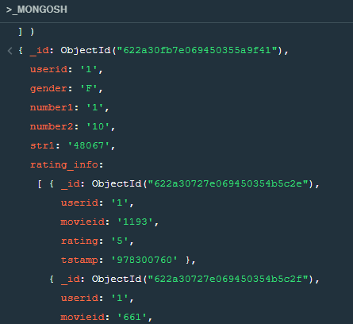
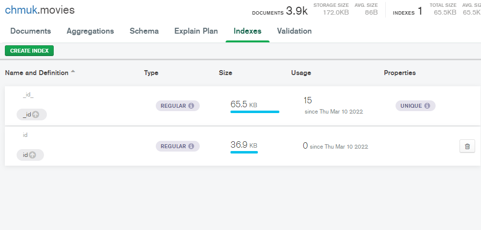
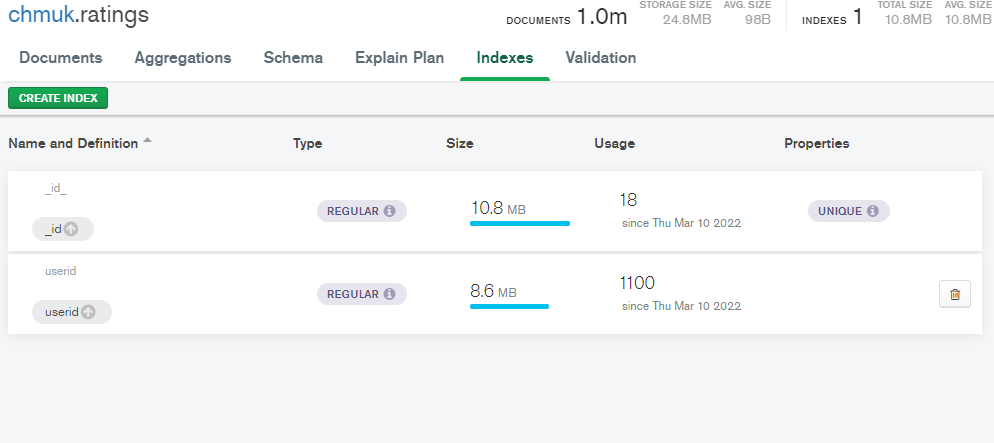
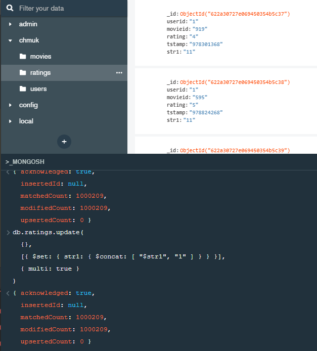

# dbHWs

### Аггрегирование без индексов (посмотрим, какие отзывы оставили первые n пользователей):
 
Сам запрос без индексов:
 
<code>
db.users.aggregate( [ 
   {$limit:1000}, 
   { 
      $lookup: 
         { 
           from: "ratings", 
           let: { userid_in_ratings: "$userid" }, 
            pipeline: [ 
               { $match: 
                  { $expr: 
                     { $and: 
                        [ 
                          { $eq: [ "$userid",  "$$userid_in_ratings" ] } 
                        ] 
                     } 
                  } 
               } 
            ], 
            as: "rating_info" 
          } 
    } 
] ).explain("executionStats") 
</code>
 
Фрагмент ответа: 

Время выполнения: 
executionTimeMillis: 608716
 

### Индексирование:

Время выполнения после индексирования: 
executionTimeMillis: 406 
Видим значительный прирост производительности после индексирования поля, по которому производим join в аггрегации

### Update
Сам запрос: 
<code>
db.ratings.update( 
  {}, 
  [{ $set: { str1: { $concat: [ "$str1", "1" ] } } }], 
  { multi: true } 
) 
</code>
 
Фрагмент ответа: 

 
Время выполнения: 
executionTimeMillis: 4336 

Время выполнения после индексирования: 
 executionTimeMillis: 4337 
 Индексирование не ускорило апдейт всех полей, что логично и ожидаемо
