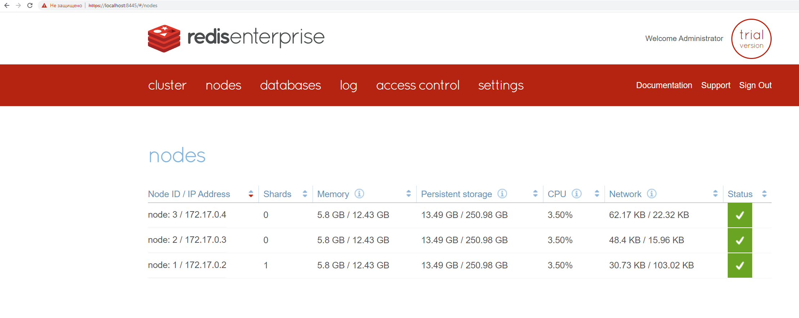
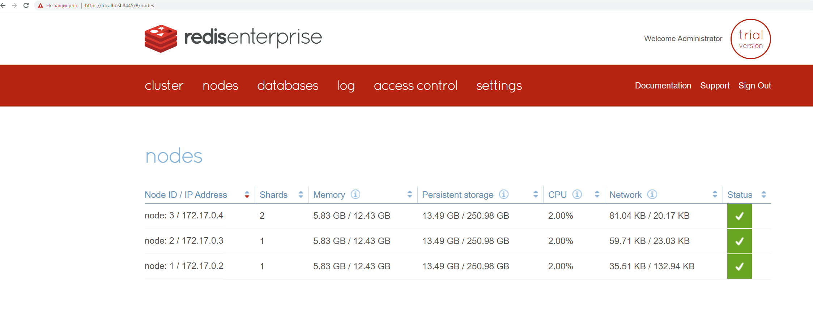
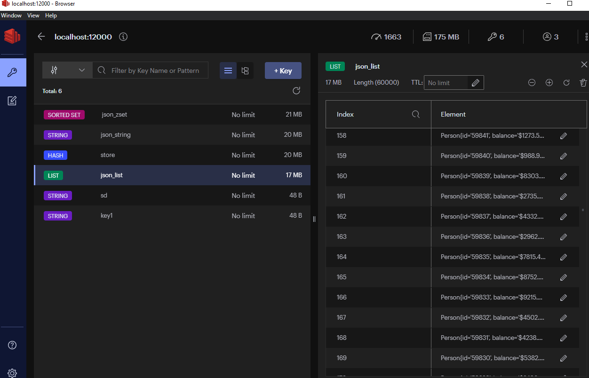

#HW Redis

## Ноды:

## Ноды после настройки репликации и шардинга:

## БД:

## Отключение одной ноды в докере:

## Ключи:

##Запуск на 3 нодах (репликация = 2, 4 шарда)
* writeString Time: 463
* readString Time: 473
* writeList Time: 294
* readList Time: 507
* writeZset Time: 368
* readZset Time: 560
* writeHash Time: 37477
* readHash Time: 34277

##Запуск на 2 нодах (репликация = 2, 3 шарда)
* writeString Time: 395
* readString Time: 501
* writeList Time: 290
* readList Time: 506
* writeZset Time: 377
* readZset Time: 559
* writeHash Time: 38478
* readHash Time: 34193

##Запуск на 1 нодe (репликация = 1, 1 шард)
* writeString Time: 322
* readString Time: 463
* writeList Time: 257
* readList Time: 493
* writeZset Time: 337
* readZset Time: 558

Как мы видим, чем меньше шардов, тем в целом, быстрее запись, но не чтение, как и ожидалось.  
Самая быстрая запись у list, а самое быстрое чтение у строки.  
Аномально большое значение для Hash связано с большим количеством межсетевого взаимодействия (на один add и read - один запрос)